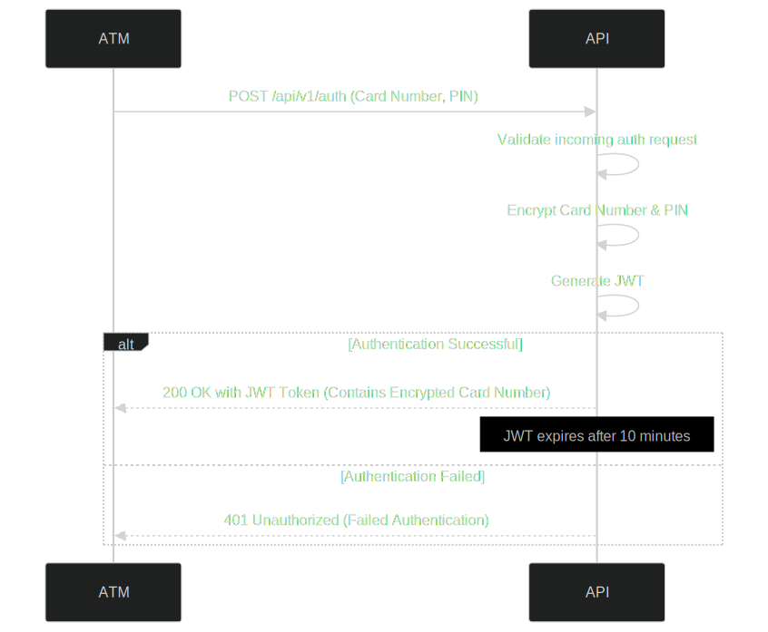

# API Startup

Follow this step at the AtmChallenge Root Folder.

1. Configure the postgres volume folder.

In the line 13 of the docker-compose.yml there is the path for the persistent volume.

The default volume works fine for MacOS/Linux.

```yml
    volumes:
      - ~/challenge-atm-data:/var/lib/postgresql/data
```

For Windows, you should specify your volume path.

```yml
    volumes:
      - C:/Users/YourUsername/challenge-atm-data:/var/lib/postgresql/data
```


2. In order to startup the API and the DB you should run the following command.

```bash
    docker-compose --profile local up
```

That will startup the database and once it's ready to accept connection, it will start the EF Migration automatically.

3. Run the following command to Add test Data.

```bash
    docker exec -i postgres_container psql -U postgres -d postgres < init-script.sql
```

4. Now you can enter the Swagger Page at:

```
http://localhost:8080/swagger/index.html
```

# Sample Data:

You can test the endpoints with the following credit cards:

```text
ANDRÉS:
    Card #1: 5218395232872386, PIN: 436826  -- This card contains some sample Operations
    Card #2: 6550848153281573, PIN: 7185
PEDRO:
    Card #1: 5249424854841018, PIN: 746288
LEO:
    Card #1: 341551726417507,  PIN: 46068
```

# Endpoint Consideration

Once it's authenticated you only need the JWT token for the balance/operations and withdrawal endpoint.

For the withdrawal endpoint there is an Idempotency-Key, you should specify there any random string.
The goal it's to make the withdrawal idempotent in case of any network failure for instance.

If you use the same Idempotency-Key the withdrawal with not be processed

## Login example:

```bash
    curl -X 'POST' \
      'http://localhost:8080/api/v1/auth/login' \
      -H 'accept: */*' \
      -H 'Content-Type: application/json' \
      -d '{
      "cardNumber": "5218395232872386",
      "pin": "436826"
    }'
```
Inside the JWT Token there is a custom claim that contain the card number encrypted

## Balance example:
Here you need to put the token that you got on the login endpoint
```bash
    curl -X 'GET' \
  'http://localhost:8080/api/v1/card/balance' \
  -H 'accept: */*' \
  -H 'Authorization: Bearer access_token_here'
```

## Operations endpoint example:

```bash
    curl -X 'GET' \
      'http://localhost:8080/api/v1/card/operations?page=1&pageSize=10' \
      -H 'accept: */*' \
      -H 'Authorization: Bearer access_token_here'
```

## Withdrawal endpoint example:

```bash
    curl -X 'POST' \
    'http://localhost:8080/api/v1/card/withdrawal' \
    -H 'accept: */*' \
    -H 'Idempotency-Key: random_key_here' \
    -H 'Authorization: Bearer access_token_here' \
    -H 'Content-Type: application/json' \
    -d '{
    "amount": 1000
    }'
```

# Diagrams

### ER


### Sequence Diagram Login



### Sequence Diagram Balance


### Sequence Diagram Withdrawal


### Sequence Diagram Operations


# Encryption
In order to keep the sensitive data secure, the API it's using AES 256-bit encryption.
That encrypts the card number and the pin once it's authenticated.

There is no plain card numbers or pins, stored in the database or in transit for the rest of the operataion.

The API provides a default secret key 32 bytes and AES IV of 16 bytes.

Optional Steps:

If you want to add your own keys you need to follow this steps:

1. Create the 32 bytes AES SECRET KEY for 256-bit encryption
   openssl rand -base64 32

2. Creates the 16 bytes AES IV for 126-bit block size
   openssl rand -base64 16

Configure the env variables into the docker-compose file.


